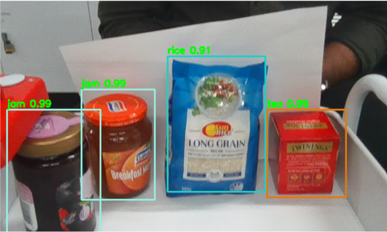
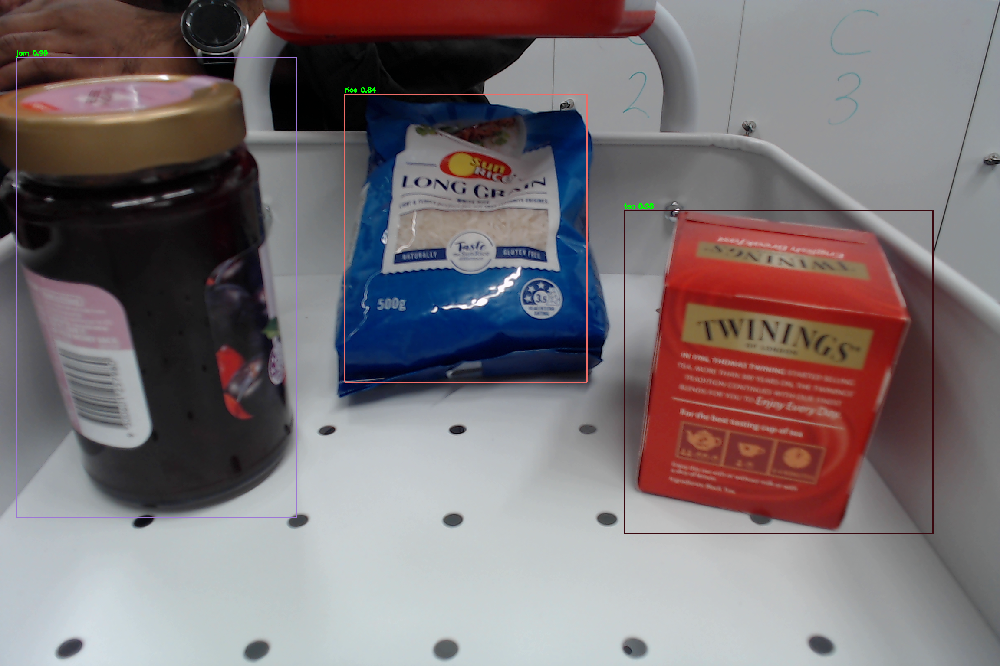

# smart-shopping-trolley-checkout-camera
a security/checkout camera system prototype (RPi4 + Pi HD Camera/Logitech 1080p 30FPS Webcam) was developed as a demonstration to go on a new smart trolley system utilising machine learning computer vision with the goal of reducing/removing customer checkout times

# software process & performance
machine learning model: trained on google research colab pro through yolo4 tiny (27 filters used)
dataset: groceries object detection dataset (https://github.com/aleksandar-aleksandrov/groceries-object-detection-dataset)
trained items: rice, tea, jam, honey
predictive performance: 0.86 (f1 score - precision & recall criterion)

# grocery item detection at checkout

